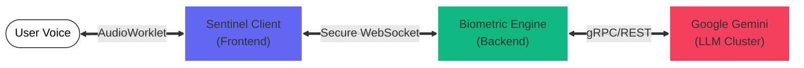

# VoxSentinel
### Identity-Secured Conversational Intelligence

> **"Bridging the gap between real-time signal processing and large language models."**

**VoxSentinel** is an enterprise-grade biometric security platform that authenticates users via unique vocal signatures while providing real-time, adaptive linguistic coaching. It was engineered to solve the challenge of **secure communication in untrusted environments**.

---

## 🏛️ System Modules

The architecture is decoupled into two high-performance microservices. Click below to explore the engineering deep-dives for each stack.

### [🖥️ Frontend Terminal (taalk-buddy)](./taalk-buddy/README.md)
*   **The Interface**: An edge-ready biometric terminal.
*   **Engineering Highlights**: `AudioWorklet` for non-blocking stream processing, `WebSockets` for binary transfer, and `OffscreenCanvas` for 60fps frequency visualization.
*   [**View Frontend Architecture →**](./taalk-buddy/README.md)

### [🧠 Neural Engine (backend2)](./backend2/README.md)
*   **The Brain**: A scalable inference cluster.
*   **Engineering Highlights**: Asynchronous Event Loop (`asyncio`), GPU-accelerated Speaker Verification (`Eagle`), and Retrieval-Augmented Generation (`RAG`) with Vector Memory.
*   [**View Backend Architecture →**](./backend2/README.md)

---

## ⚡ Core Capabilities

*   **🛡️ Zero-Trust Audio**: Every frame of audio is verified against a biometric enrollment vector before processing.
*   **🚀 Event-Driven**: Fully asynchronous pipeline handles multiple concurrent streams with negligible blocking.
*   **🧠 Context-Aware**: Integrates Vector Search (ChromaDB) to provide coaching based on long-term user history.
*   **☁️ Cloud-Native**: Containerized (Docker) and orchestration-ready (Compose) for scalable deployment.

---

## 🔁 System Data Flow

---

*Engineered by **Varun B**.*
*📧 [Contact via Email](mailto:varub5725@gmail.com)*
