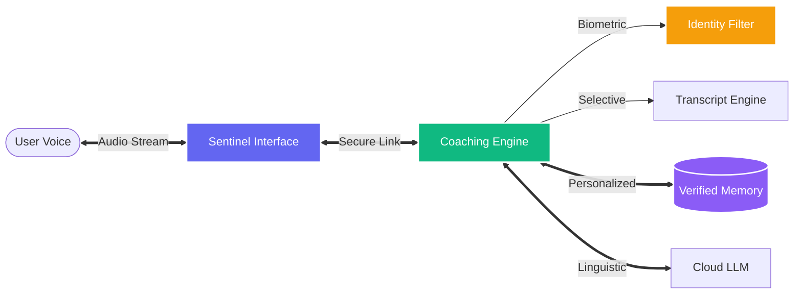

  

<h1 align="center">VoxSentinel</h1>

  <strong>Voice-Verified Intelligence for the Introverted Speaker</strong>

  
  
  

---

## 🎯 Problem Statement – VoxSentinel

Many introverted individuals face significant difficulty during spoken conversations. Although they often know what they want to say, they struggle to express their thoughts verbally due to hesitation, lack of confidence, or fear of interruption. This problem becomes more serious in real-world social conversations, where multiple people are involved and real-time responses are required.

### Limitations of Existing Systems:
*   **No Speaker Identity Control**: Most systems respond to any nearby voice and cannot identify the intended user, leading to privacy issues, incorrect personalization, and irrelevant responses.
*   **Lack of Real-Time Conversational Support**: Current tools are either offline or designed for simple speech-to-text; they do not provide real-time assistance during live, dynamic conversations.
*   **No Behavior-Aware Coaching**: Existing applications do not analyze speech behavior (such as pauses or hesitation patterns) to determine when a user actually needs help.
*   **Unsafe Memory Handling**: Storing conversation data without verifying identity risks privacy and undermines user trust.

---

## ✅ Our Solution Approach – VoxSentinel

VoxSentinel is a voice-verified, cloud-based conversational coaching system designed to assist introverted users in improving their spoken English through two intelligent operating modes.

### 1. 🛡️ Voice-Verified AI Practice Mode
**Objective**: To help users improve spoken English by practicing conversations with AI in a safe and personalized environment.

*   **Voice Registration**: The user enrolls their voice once to create a secure, personal profile.
*   **Continuous Verification**: Every audio frame is verified during live streaming; the system only listens and responds if the speaker matches the registered voice.
*   **Trusted Processing**: Only verified speech is processed and stored in memory, building a uniquely personalized AI experience over time.

### 2. 👥 Real-World Monitoring & Coaching Mode
**Objective**: To assist the registered user during real conversations with other people, without interrupting natural flow.

*   **Selective Attention**: The system classifies speakers into "Registered User" or "Guest." Guest speech is used for context but is never stored or coached.
*   **Hesitation Detection**: The system analyzes the registered user’s speech for long pauses or patterns indicating they may be struggling to find their words.
*   **Conditional Coaching**: If the user is struggling, the AI generates a single, confident sentence suggestion to help them move forward. If the user is speaking fluently, the system remains silent to maintain natural flow.

---

## ⚡ Technical Capabilities

*   **Identity-Secured Processing**: Ensures the system only acts on authorized voice signals.
*   **Dual-Channel Intelligence**:
    *   **Private Practice**: High-security, low-latency AI interaction.
    *   **Live Monitoring**: Multi-speaker selective transcription and classification.
*   **Adaptive Memory**: Conversational memory that is exclusive to the verified user, ensuring high privacy and contextual accuracy.
*   **Behavioral Support**: Real-time behavioral analysis to provide help only when the user genuinely needs it.

---

## 🏛️ System Modules

VoxSentinel is built as a high-performance decoupled architecture. Explore the detailed engineering for each module:

### [🖥️ Frontend Terminal (taalk-buddy)](./taalk-buddy/README.md)
*   **The Interface**: An edge-ready biometric terminal.
*   **Key Tech**: Audio streaming (`AudioWorklet`), binary transfer (`WebSockets`), and real-time visualization (`Canvas API`).
*   [**View Frontend Architecture →**](./taalk-buddy/README.md)

### [🧠 Neural Engine (backend2)](./backend2/README.md)
*   **The Brain**: A scalable inference cluster.
*   **Key Tech**: Asynchronous Event Loop (`asyncio`), biometric verification, and personalized voice-aware memory.
*   [**View Backend Architecture →**](./backend2/README.md)

---

## 🏛️ System Design

---

*Engineered by **Varun B**.*
*📧 [Contact via Email](mailto:varub5725@gmail.com)*
