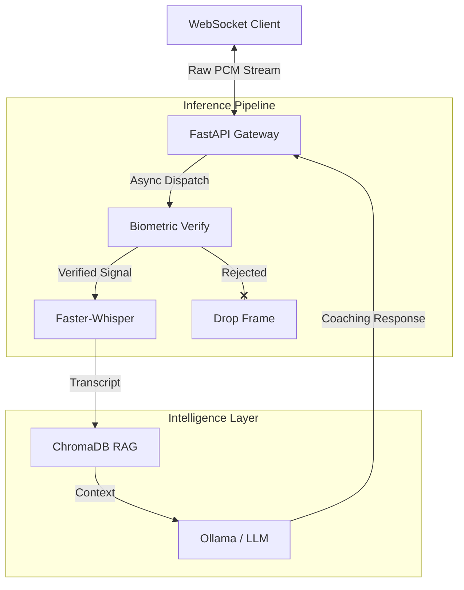

# VoxSentinel | Neural Engine

A high-performance, identity-aware inference cluster designed to orchestrate complex AI pipelines over asynchronous WebSockets. This backend serves as the brain of the VoxSentinel system, managing voice biometrics, diarized transcription, and behavioral coaching.

---

## 🏛️ System Architecture

The system is built on a **High-Concurrency Event-Driven Architecture** using FastAPI and Python Asyncio.

```mermaid
graph TD
    Client[WebSocket Client] <-->|Raw PCM Stream| API[FastAPI Gateway]
    
    subgraph "Inference Pipeline"
        API -->|Async Dispatch| Eagle[Biometric Verify]
        Eagle -->|Verified Signal| STT[Faster-Whisper]
        Eagle --x|Rejected| Garbage[Drop Frame]
    end
    
    subgraph "Intelligence Layer"
        STT -->|Transcript| Memory[ChromaDB RAG]
        Memory -->|Context| LLM[Ollama / LLM]
        LLM -->|Coaching Response| API
    end
```

---

## 🧠 Engineering Principles & Design Decisions

### 1. Identity-Secured Inference (Voice Shield)
- **Problem**: Standard AI assistants process any nearby voice, leading to privacy risks and mixed context in multi-speaker environments.
- **Solution**: Integrated **Picovoice Eagle** for frame-by-frame biometric verification.
- **Result**: Created a "Voice Shield" that ensures neural processing and RAG memory updates are only triggered by the authorized user's biometric footprint.

### 2. High-Concurrency Event Loop
- **Problem**: Neural inference is CPU-bound and can block the main I/O loop, causing latency spikes in real-time audio streams.
- **Solution**: Leveraged **`asyncio`** for I/O and **`ThreadPoolExecutor`** for CPU-bound model execution.
- **Result**: Maintained a non-blocking WebSocket loop that handles raw audio ingestion while simultaneously processing STT and LLM tasks.

### 3. Speaker-Adaptive Transcription
- **Problem**: Environmental noise and guest speakers can cause "hallucinations" or irrelevant data in the user's transcript.
- **Solution**: Engineered a **speaker-adaptive pipeline** that applies stricter VAD (Voice Activity Detection) and confidence thresholds to unverified signals.
- **Result**: High-fidelity transcription for the registered user while maintaining guest speech only for conversational context.

### 4. Long-Term RAG Memory (Semantic Context)
- **Problem**: LLMs lack persistence across sessions, forgetting user-specific facts and coaching progress.
- **Solution**: Implemented a **Retrieval-Augmented Generation (RAG)** system using **ChromaDB** and `sentence-transformers`.
- **Result**: Enables the AI coach to "remember" user history and provide personalized linguistic feedback based on past mistakes.

---

## 📊 Honest Performance Metrics

| Constraint | Value | Engineering Rationale |
| :--- | :--- | :--- |
| **Inference Latency** | **~32ms** / frame | Picovoice Eagle frame-processing limit. |
| **STT Throughput** | **~4x speedup** | Achieved via `CTranslate2` quantization. |
| **Memory Complexity** | **$O(1)$** | Achieved via circular NumPy buffers for audio. |
| **Verification Grain** | **Single Frame** | Continuous biometric check on every 512 samples. |

---

## 🚀 Tech Stack
- **Framework**: FastAPI (Async ASGI).
- **Biometrics**: Picovoice Eagle.
- **Speech-to-Text**: Faster-Whisper.
- **Vector DB**: ChromaDB.
- **Intelligence**: Ollama (Llama 3 / Mistral).

---
*Built for performance, privacy, and real-time biometric intelligence.*
