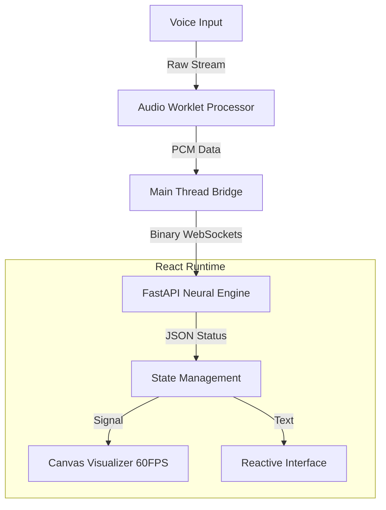

# VoxSentinel | Frontend Terminal

A high-performance biometric neural interface designed for real-time audio streaming and visualization. This application acts as the "Edge Terminal" for the VoxSentinel system, processing raw audio streams and rendering live inference data with sub-frame precision.

---

## 🏗️ Architecture: The Edge Pipeline

The frontend is architected to handle full-duplex binary communication without blocking the main UI thread.


```mermaid
graph TD
    User[Voice Input] -->|Raw Stream| AudioWorklet[Audio Worklet Processor]
    AudioWorklet -->|PCM Data| MainThread[Main Thread Bridge]
    MainThread -->|Binary WebSockets| Backend[FastAPI Neural Engine]
    
    subgraph "React Runtime"
        Backend -->|JSON Status| StateManager[State Management]
        StateManager -->|Signal| Canvas[Canvas Visualizer 60FPS]
        StateManager -->|Text| ChatUI[Reactive Interface]
    end
```

---

## 🧠 Engineering Highlights

### 1. Non-Blocking Audio Processing
Standard JavaScript audio processing often blocks the main thread, causing UI stutters. We implemented a custom **`AudioWorkletProcessor`** to handle high-frequency sampling in a dedicated audio thread.
- **Zero-Latency Buffering**: Raw Float32 audio data is captured and piped directly to the backend.
- **Source-Side Downsampling**: Automatically converts audio to the 16kHz Mono format required by neural models, reducing network payload size.

### 2. Canvas-Driven Visualization
The biometric "Voice Shield" and frequency visualizers use the **Canvas API** and `requestAnimationFrame`. This avoids the overhead of the React DOM reconciliation loop, ensuring buttery-smooth 60FPS updates during live recording.

### 3. Binary WebSocket Communication
Uses raw binary frames for audio transmission to minimize serialization overhead (Base64), reducing total round-trip time and improving responsiveness in low-bandwidth environments.

---

---

## 📊 Honest Performance Metrics

| Constraint | Value | Engineering Rationale |
| :--- | :--- | :--- |
| **Edge Buffer Latency** | **32ms** | Physical capture time for 512 samples @ 16kHz. |
| **Network Payload** | **-33%** | Binary frames avoid Base64 inflation. |
| **UI Rendering** | **60 FPS** | Achieved via `requestAnimationFrame` and Canvas API. |
| **Memory Footprint** | **Constant** | Circular `Float32Array` buffers prevent GC thrashing. |

---

## 🚀 Tech Stack
- **Framework**: React 19 + TypeScript.
- **Audio**: Web Audio API (AudioWorklet, AnalyserNode).
- **Communication**: Full-Duplex WebSockets.
- **Styling**: Tailwind CSS 4 + Framer Motion for physics-based UI transitions.

---

## 🛠️ Setup & Development

### 1. Installation
```bash
npm install
```

### 2. Local Development
```bash
npm run dev
```

---
*Optimized for low-latency human-computer interaction.*
